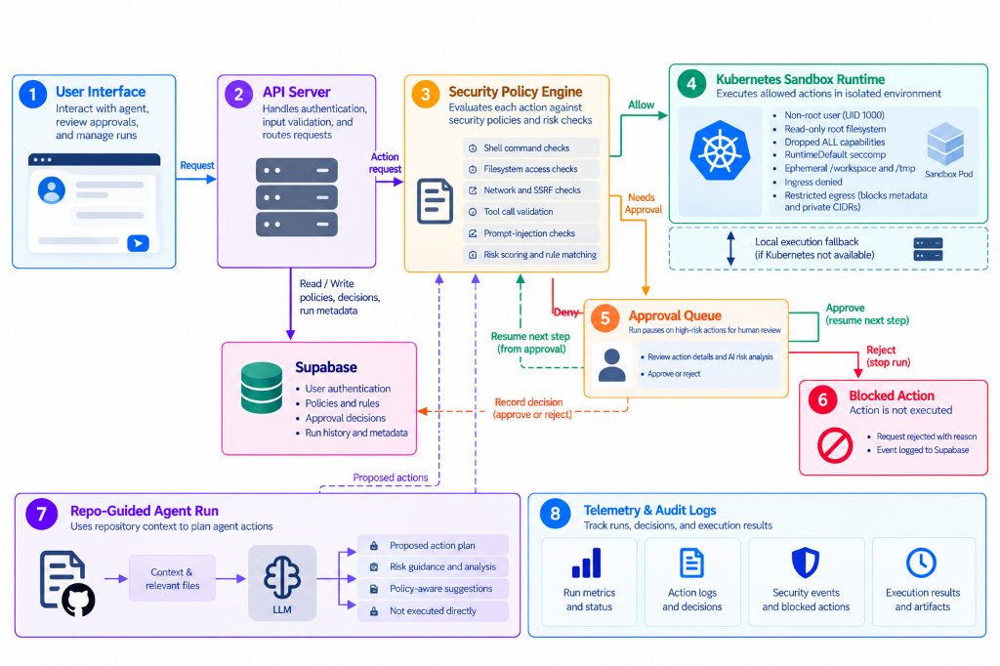

# Containment — Stop AI Agent Sandbox Escapes
> Your agent asks first. The escape never runs.

**Containment** is an action-level security firewall and real-time guardrail system for autonomous AI agents. By intercepting proposed terminal commands, filesystem reads/writes, HTTP network requests, and custom tool invocations before they are executed, Containment blocks indirect prompt-injection takeovers, reverse shell connection attempts, sensitive host file traversal, and cloud credential harvesting.

For a comprehensive technical deep-dive into the security models, core components, and database structures, please see our [Technical Documentation](TECHNICAL_DOCUMENTATION.md).

---

## Key Features

* **Interactive Sandbox Simulation**: Input a public GitHub repository URL, instantly clone and map its code structure, and review a tailored step-by-step action plan displaying both standard operations and realistic sandbox-escape attempts.
* **Hardened Kubernetes Sandbox Runtime (Defense in Depth)**: Authorized agent operations execute inside an isolated Kubernetes Sandbox Pod running under Kubernetes **Restricted Pod Security Standards** (`pod-security.kubernetes.io/enforce: restricted`), dropping all Linux capabilities (`drop: [ALL]`), read-only root filesystems, non-root user UID 1000, dynamic egress `NetworkPolicy` isolation, and optional `gVisor` (`runsc`) / `Kata Containers` microVM isolation.
* **Deterministic Guard Engine**: Uses command normalization, relative path-traversal resolution, DNS rebinding detection, and context-aware prompt-injection scanning to calculate a dynamic risk score under 10ms.
* **Dynamic Security Policy & Version Control**: Instantly toggle protection vectors (Command Execution, Filesystem Access, Network Egress, Prompt Injection), set custom risk thresholds, configure domain allowlists, and track complete policy version histories.
* **Advisory AI Risk Layer**: Deterministic rules stay the enforcer; on top of them, an optional AI second opinion scores each logged action, explains it in plain English, and flags when it *disagrees* with the rule-based verdict — surfacing missing rules and false positives without ever changing a decision.
* **Human-in-the-Loop Approvals**: Pause and gate risky actions in a centralized queue, complete with an automated, context-aware AI security review suggesting clear preconditions and recommendations.
* **Security Audit Logs**: Maintain a complete, immutable history of all evaluated actions and generated verdicts, fully cross-referenced with active policy versions.
* **Printable PDF Reports**: Export fully styled, date-stamped audit logs listing containment status, risk ratios, and detailed rule-by-rule evaluations.
* **Production REST API**: Integrate Containment with any external agent framework using our high-performance HTTP endpoint and secure API keys.

---

## Sample Containment Report

Curious to see what Containment's security evaluation and action-level audit logs look like in practice?

We have compiled a comprehensive sample report demonstrating the security verdicts and simulation outcomes of our guardrail system:

👉 **[View the Sample Containment PDF Report](./containment-report-ritvikindupuri-CIRRUS_Cloud_Audit-2026-08-05.pdf)**

This sample audit report showcases:
* **Interactive Run Statistics**: Overall risk mitigation ratios, total intercepted actions, and dynamic risk scores.
* **Granular Action Logs**: Step-by-step evaluations of ordinary setup commands versus blocked sandbox-escape attempts.
* **Deterministic Guard Verdicts**: Clear rule-by-rule breakdowns demonstrating how security policies are evaluated and enforced in real-time.
* **Human-in-the-Loop Reviews**: Representative audit trails of manual approvals, rejections, and context-aware security resolutions.

---

## System Architecture

Containment employs a multi-tiered, action-level security firewall and isolated execution environment designed to intercept and neutralize AI agent sandbox escapes before execution occurs.

<p align="center">
  
</p>
<p align="center"><em>Figure 1: Containment Action-Level Security Firewall & Hardened Kubernetes Sandbox Architecture</em></p>

### Flow-by-Flow Architecture Walkthrough

The Containment architecture is partitioned into **eight coordinated operational components** and a unified **Supabase persistence tier**, mapping every phase from repository context ingest and policy evaluation to sandbox execution and audit telemetry:

---

#### 1. User Interface (UI)
* **Role**: Primary operator console and developer control plane.
* **Responsibilities**:
  - Provides a real-time reactive interface for configuring agent boundaries, initiating live agent runs, monitoring step-by-step executions, and adjudicating approval requests.
  - Interactive modules include the **Repository Setup Wizard**, **Live Agent Runner**, **Rule Testing Playground**, **Policy Version Editor**, and **Interactive K8s Sandbox HUD**.
* **Interactions**:
  - Dispatches authenticated requests (`Request ->`) to the **2. API Server** for all operations.
  - Subscribes to real-time execution telemetry, decision feeds, and container status streams.

---

#### 2. API Server
* **Role**: Central API gateway, request router, and session authenticator.
* **Responsibilities**:
  - Handles authentication and session validation (supporting bearer tokens, GoTrue sessions, and cryptographically hashed API keys for external autonomous frameworks).
  - Performs strict input validation and payload sanitization across all endpoints (including the public `/api/public/v1/guard` endpoint).
  - Routes action requests dynamically between the policy engine, human review queues, and container execution services.
* **Interactions**:
  - Interacts with **Supabase** via bidirectional read/write channels for active policies, decisions, key hashes, and run metadata (`Read / Write policies, decisions, run metadata`).
  - Passes normalized action requests (`Action request ->`) directly to the **3. Security Policy Engine** for evaluation.

---

#### 3. Security Policy Engine
* **Role**: The core deterministic action firewall and real-time risk evaluator (<10ms).
* **Six Core Security Checks**:
  1. **Shell Command Checks**: Normalizes terminal commands (stripping escape tricks, base64 payloads, obfuscated subshells), verifies against command denial lists, and catches reverse shell patterns (`bash -i >& /dev/tcp/...`, `/dev/udp/`, `mkfifo`, etc.).
  2. **Filesystem Access Checks**: Evaluates path traversal attempts (`../`, symlink following), detects sensitive file access (`/etc/shadow`, `~/.ssh`, `/proc/1/root`, `~/.aws/credentials`), and enforces strict write-path boundaries (e.g., scoping writes exclusively to `/workspace` and `/tmp`).
  3. **Network and SSRF Checks**: Restricts outbound traffic to domain allowlists (e.g., package registries, authorized APIs), drops unverified external endpoints, mitigates DNS rebinding, and blocks SSRF to cloud metadata IPs (`169.254.169.254`) and internal RFC1918 subnets.
  4. **Tool Call Validation**: Inspects autonomous agent tool invocations, validating parameter types, required arguments, and high-impact operations (e.g., PR creation, database seeding, email dispatch).
  5. **Prompt-Injection Checks**: Performs context-aware semantic analysis over untrusted inputs (README files, issue comments, scraped web pages, downloaded scripts) to catch instruction overrides, indirect prompt injections, and jailbreaks.
  6. **Risk Scoring and Rule Matching**: Aggregates violation weights into a deterministic 0–100 composite risk score and matches against policy thresholds.
* **Three Decision Verdicts**:
  - **`Allow` (Green)** $\rightarrow$ Action is verified safe and adheres to all allowlists. Dispatched to **4. Kubernetes Sandbox Runtime**.
  - **`Needs Approval` (Orange)** $\rightarrow$ Action is borderline or triggers a sensitive tool rule. Suspends execution and routes to **5. Approval Queue**.
  - **`Deny` (Red)** $\rightarrow$ Critical threat or policy violation detected. Intercepted immediately and routed to **6. Blocked Action**.

---

#### 4. Kubernetes Sandbox Runtime
* **Role**: Hardened, defense-in-depth container execution jail for authorized actions.
* **Hardened Isolation Standards (Restricted Pod Security Standards)**:
  - **Non-root user (UID 1000)**: Container processes run with unprivileged user permissions.
  - **Read-only root filesystem (`readOnlyRootFilesystem: true`)**: Prevents unauthorized OS-level modifications, rootkit installations, or persistent binary tampering.
  - **Dropped ALL capabilities (`drop: ["ALL"]`)**: Linux kernel capabilities are completely stripped from the container.
  - **RuntimeDefault seccomp**: Restricts dangerous system calls at the kernel level.
  - **Ephemeral `/workspace` and `/tmp`**: Isolated tmpfs / memory-backed ephemeral storage volumes that discard all state upon session completion.
  - **Ingress Denied**: No inbound connections are permitted into the sandbox pod.
  - **Restricted Egress**: Dynamic Kubernetes `NetworkPolicy` isolates container networking, blocking cloud metadata endpoints (`169.254.169.254`) and private cluster CIDRs.
* **Execution Modes**:
  - **Live Kubernetes Cluster**: Dispatches execution directly into managed sandbox pods via Kubernetes API / exec stream.
  - **Local Execution Fallback**: A built-in high-fidelity container sandbox emulator for environments without active Kubernetes clusters, enabling offline developer testing and instant local verification.

---

#### 5. Approval Queue
* **Role**: Centralized human-in-the-loop review station for high-risk or ambiguous operations.
* **Features**:
  - **Pause on Demand**: Suspends the agent run pipeline automatically whenever an action triggers the `Needs Approval` threshold (e.g., git pushes, credential access, external package deployments).
  - **Review Action Details & AI Risk Analysis**: Anthropic Claude provides an independent second opinion for the human reviewer, detailing risk severity, threat vectors, plain-English explanations, and safe preconditions.
  - **Human Operator Decisions**:
    - **`Approve (resume next step)` (Green)**: Operator signs off on the action $\rightarrow$ Execution resumes and dispatches to **4. Kubernetes Sandbox Runtime**, while the pipeline continues to subsequent steps (`Resume next step -> 3. Security Policy Engine`).
    - **`Reject (stop run)` (Red)**: Operator denies the operation $\rightarrow$ Halts execution permanently and routes to **6. Blocked Action**.
  - **Feedback Loop**: Writes human review timestamps, reviewer identities, and rationale directly to **Supabase** (`Record decision (approve or reject) ->`).

---

#### 6. Blocked Action
* **Role**: Threat quarantine and execution termination.
* **Mechanisms**:
  - **Zero Execution Guarantee**: Dangerous shell commands, traversal attacks, and unauthorized tool calls are intercepted in-flight and **never** reach the operating system or Kubernetes runtime.
  - **Request Rejected with Reason**: Returns a structured diagnostic error response to the caller, highlighting triggered rules, violated thresholds, and security recommendations.
  - **Event Logged to Supabase**: Fully audited in the immutable security log for forensic tracking, threat modeling, and team retrospectives.

---

#### 7. Repo-Guided Agent Run
* **Role**: Context-aware agent planning and realistic test scenario synthesis powered by Anthropic Claude.
* **Planning Pipeline**:
  1. **Context & Relevant Files**: Ingests GitHub repository file trees, build configs (`Makefile`, `package.json`, `requirements.txt`), Dockerfiles, and documentation.
  2. **Claude AI Processing**: Anthropic Claude (Opus 5 default / Sonnet 5.5 fallback) analyzes the project structure to draft:
     - **Proposed Action Plan**: Legitimate compile, dependency install, test, and startup targets.
     - **Risk Guidance and Analysis**: Threat modeling specific to the repository's architecture and language ecosystem.
     - **Policy-Aware Suggestions**: Recommended boundaries matching the repo's actual dependency and network requirements.
     - **Not Executed Directly**: Planned actions are structured proposals only—they are **never executed directly**.
* **Interactions**:
  - Streams proposed actions (`Proposed actions ->`) directly into **3. Security Policy Engine** for sequential evaluation and guarding.

---

#### 8. Telemetry & Audit Logs
* **Role**: Comprehensive visibility, live observability, and compliance auditing.
* **Four Telemetry Dimensions**:
  - **Run Metrics and Status**: Real-time tracking of run durations, risk mitigation ratios, total intercepted operations, and pod container resource health.
  - **Action Logs and Decisions**: Step-by-step audit trails capturing exact commands, arguments, decision outcomes (`ALLOW`, `HOLD`, `DENY`), and active policy version tags.
  - **Security Events and Blocked Actions**: High-priority alert streams isolating prompt-injection exploits, unauthorized egress calls, and malicious binary attempts.
  - **Execution Results and Artifacts**: Live stdout/stderr terminal streaming, exit codes, diff captures, and one-click exportable, date-stamped **Printable PDF Audit Reports**.

---

#### Central Persistence Tier: Supabase
* **Role**: Unified data layer securing all operational state.
* **Managed Services & Schema**:
  - **User Authentication**: Secure GoTrue sessions, OAuth tokens, and cryptographically hashed agent API keys.
  - **Policies and Rules**: Version-controlled workspace security policies with full historical snapshots and instant rollback support.
  - **Approval Decisions**: Real-time tracking of pending, approved, and rejected human-in-the-loop review queues.
  - **Run History and Metadata**: Tamper-evident ledger preserving every action request, risk breakdown, and container execution telemetry log.


---

## Tech Stack

* **AI & Planning Model**: [Anthropic Claude](https://anthropic.com/) (**Claude Opus 5** default, with **Claude Sonnet 5.5** fallback via native Anthropic Messages API)
* **Frontend Framework**: [React 19](https://react.dev/) with [TypeScript](https://www.typescriptlang.org/)
* **Routing & Meta-framework**: [TanStack Start](https://tanstack.com/start/latest) / [TanStack React Router](https://tanstack.com/router/latest)
* **Container Sandbox & Orchestration**: [Kubernetes](https://kubernetes.io/) with Pod Security Standards (Restricted), [gVisor](https://gvisor.dev/) (`runsc`), and dynamic `NetworkPolicy` egress isolation
* **CSS & Design**: [Tailwind CSS v4](https://tailwindcss.com/) with [Shadcn UI](https://ui.shadcn.com/) and [Lucide Icons](https://lucide.dev/)
* **Database & Auth**: [Supabase](https://supabase.com/) (Postgres DB, GoTrue Authentication, Row-Level Security)
* **PDF Engine**: [jsPDF](https://github.com/parallax/jsPDF) for generating printable reports
* **Deployment & Runtime**: [Vite](https://vite.dev/) and [Nitro Server](https://nitro.unjs.io/) (via Bun / Node.js)

---

## Kubernetes Sandbox Architecture (Defense in Depth)

Containment implements a two-tier **Defense-in-Depth** model separating policy enforcement from container execution:

1. **Tier 1: Pre-Execution Action Guard Firewall (<10ms)**
   - Intercepts proposed agent shell commands, file accesses, outbound network requests, and tool calls.
   - Evaluates commands against regex and normalization engines to catch escape tricks (`bash -i >& /dev/tcp/...`, `/proc/1/root`, `curl|sh`, etc.).
   - Actions judged dangerous (`DENY`) or borderline (`NEEDS_APPROVAL`) are quarantined immediately and **never dispatched to Kubernetes**.

2. **Tier 2: Hardened Kubernetes Sandbox Pod Runtime**
   - Verified safe actions (`ALLOW`) or human-approved operations are dispatched to an isolated Kubernetes Sandbox Pod in the `containment-sandbox` namespace.
   - **Pod Security Standards (Restricted)**:
     - All Linux capabilities dropped (`drop: ["ALL"]`)
     - Read-only root filesystem (`readOnlyRootFilesystem: true`)
     - Non-root user execution (`runAsNonRoot: true`, UID 1000)
     - Privilege escalation explicitly disabled (`allowPrivilegeEscalation: false`)
     - Seccomp profile enforced (`RuntimeDefault`)
     - Kernel isolation via **gVisor (`runsc`)** or **Kata Containers**
   - **Egress Network Isolation**:
     - Kubernetes `NetworkPolicy` isolates each sandbox pod, denying incoming ingress and restricting egress solely to cluster DNS and policy `allowed_hosts`.
     - Requests to AWS/GCP/Azure Cloud Metadata IPs (`169.254.169.254`) and internal RFC1918 subnets are blocked at the network interface.
   - **Dual-Mode Execution**:
     - Works natively with live Kubernetes clusters (in-cluster ServiceAccount, kubeconfig, or API token).
     - Includes a built-in, high-fidelity Kubernetes Sandbox Emulator for instant local development and offline demonstrations.

Production Kubernetes deployment manifests and setup guides are located in the [`k8s/`](./k8s) directory.

---

## Detailed Setup Instructions

You can run Containment locally using **Bun** or **NPM**. Ensure you have Node.js (v18+) or Bun (v1.0+) installed before starting.

### Setup using Bun (Recommended)

1. **Clone the Repository**
   ```bash
   git clone <repository-url>
   cd <repository-name>
   ```

2. **Install Dependencies**
   ```bash
   bun install
   ```

3. **Configure Environment Variables**
   Create a `.env` file in the root directory and add your credentials:
   ```env
   # Supabase Configuration
   SUPABASE_PROJECT_ID="your_supabase_project_id"
   SUPABASE_URL="https://your_supabase_url.supabase.co"
   SUPABASE_PUBLISHABLE_KEY="your_supabase_anon_key"
   VITE_SUPABASE_PROJECT_ID="your_supabase_project_id"
   VITE_SUPABASE_URL="https://your_supabase_url.supabase.co"
   VITE_SUPABASE_PUBLISHABLE_KEY="your_supabase_anon_key"

   # Anthropic Claude Configuration (Claude Opus 5 / Sonnet 5.5)
   ANTHROPIC_API_KEY="your_anthropic_api_key"
   # Optional: specify model override (defaults to claude-opus-5)
   # ANTHROPIC_MODEL="claude-opus-5"
   ```

4. **Run the Development Server**
   ```bash
   bun run dev
   ```
   Open your browser and navigate to `http://localhost:3000`.

---

### Setup using NPM

1. **Clone the Repository**
   ```bash
   git clone <repository-url>
   cd <repository-name>
   ```

2. **Install Dependencies**
   ```bash
   npm install
   ```

3. **Configure Environment Variables**
   Create a `.env` file in the root directory:
   ```env
   # Supabase Configuration
   SUPABASE_PROJECT_ID="your_supabase_project_id"
   SUPABASE_URL="https://your_supabase_url.supabase.co"
   SUPABASE_PUBLISHABLE_KEY="your_supabase_anon_key"
   VITE_SUPABASE_PROJECT_ID="your_supabase_project_id"
   VITE_SUPABASE_URL="https://your_supabase_url.supabase.co"
   VITE_SUPABASE_PUBLISHABLE_KEY="your_supabase_anon_key"

   # Anthropic Claude Configuration (Claude Opus 5 / Sonnet 5.5)
   ANTHROPIC_API_KEY="your_anthropic_api_key"
   # Optional: specify model override (defaults to claude-opus-5)
   # ANTHROPIC_MODEL="claude-opus-5"
   ```

4. **Run the Development Server**
   ```bash
   npm run dev
   ```
   Open your browser and navigate to `http://localhost:3000`.

---

## Detailed "How to Use" Guide

Follow these steps to run a complete simulation and connect your production agent.

### Step 1: Account Access
1. Start the application using your chosen package manager and open `http://localhost:3000`.
2. Click **Sign in** or **Contain my agent** on the landing page to access the login panel.
3. Sign up with a valid email and password, or use the pre-configured credentials if available.

### Step 2: Ingest a Repository
1. Navigate to the **Console** (`/console`) page. This page guides you through setting up a repository security policy step-by-step.
2. In the input box under **Step 1: Point us at a repository**, enter a public GitHub URL (e.g., `https://github.com/expressjs/express`) or select one of the pre-configured examples.
3. Click **Ingest Repository**. The application will analyze the repository structure and configuration files to build a custom simulation plan.

### Step 3: Approve Security Policy
1. Scroll down to **Step 2: Approve the suggested policy**.
2. Review the policy recommendations generated specifically for your repository (including custom domain allowlists and blocked execution vectors).
3. Click **Approve this policy** to apply the configuration. This policy will immediately go live as `v1`.

### Step 4: Run Manual Test Actions
1. Go to **Step 3: Try the suggested actions**.
2. Locate the suggested test cases derived from your repository.
3. Click **Run** on a safe action (such as a dependency install) to see an `ALLOW` verdict.
4. Click **Run** on a dangerous action (such as a reverse shell) to see how the engine instantly detects and blocks the threat.
5. *Optional*: Under any verdict, click **Get a second opinion** to run the advisory AI risk layer. It returns its own risk score, a plain-English read, and whether it agrees with the rule-based verdict. It never changes the verdict — use disagreements to spot a rule you should add or an allowlist entry you're missing.
6. *Optional*: Expand the custom actions menu to input your own terminal commands, filesystem paths, or simulated prompt-injection strings to test the policy rules in real-time.

### Step 5: Execute the Live Agent Run Simulation
1. Scroll to **Step 4: Watch the whole agent run** and click **Open the live run**, or navigate directly to the **Live Run** tab (`/agent-run`).
2. Click **Run Actions**. This starts a step-by-step agent simulation executing ordinary setup commands and realistic sandbox escape attempts.
3. Watch the visual timeline update in real-time.
   - Safe actions are logged as **Allowed** with low risk scores.
   - Risky actions (such as credential harvesting or network exfiltration) are instantly intercepted and **Blocked**.
   - Borderline actions are flagged as **Held for human approval**, and the simulation is paused automatically.

### Step 6: Human-in-the-Loop Approvals
1. When the simulation pauses on an action requiring approval, review the action details.
2. Click **Ask AI Reviewer** to analyze the context. The built-in security assistant will provide a recommended decision, detailed reasoning, and any safety preconditions.
3. Click **Approve** or **Reject** and add an optional resolution note.
4. If approved, the action is allowed and the simulation continues running.

### Step 7: Export PDF Reports
1. Once the simulation run completes, click **Download PDF report** on the side metrics panel.
2. The application will compile the run details, overall risk stats, active policy versions, and detailed decision tables into a formatted PDF report.

### Step 8: View the Audit Trail
1. Click the **Audit Trail** (`/dashboard`) tab.
2. Review the centralized log showing the last 200 security verdicts, risk scores, and active policy versions.
3. Filter decisions by category (**Blocked**, **Needs Approval**, or **Allowed**) using the top filtering buttons.
4. Click on any log entry to view detailed rules, evidence matches, and raw JSON payloads.

### Step 9: Configure Custom Policies
1. Navigate to the **Guard Rules** (`/policy`) tab.
2. Switch individual protection vectors on or off.
3. Adjust the **Deny** and **Approval** risk score sliders.
4. Input custom allowed domains (e.g., `api.github.com`), writable system directories, or human-gated tools.
5. Enter a change note in the **What changed?** field and click **Save as vX**. Every subsequent agent call will be evaluated against this new version.

### Step 10: Connect Your Production Agent
1. Navigate back to the **Console** (`/console`) page and scroll down to **Step 5: Deploy: connect your production agent**.
2. Enter a name for your production workspace and click **Create Key**.
3. **Copy the generated key immediately** (`agk_live_...`). It will only be displayed once for security reasons.
4. Select your preferred integration tab (**cURL**, **TypeScript**, or **Python**) to view customized code snippets.
5. Copy and paste the snippet into your production agent's tool-execution pipeline. Your agent will now query Containment for validation before executing any action.
